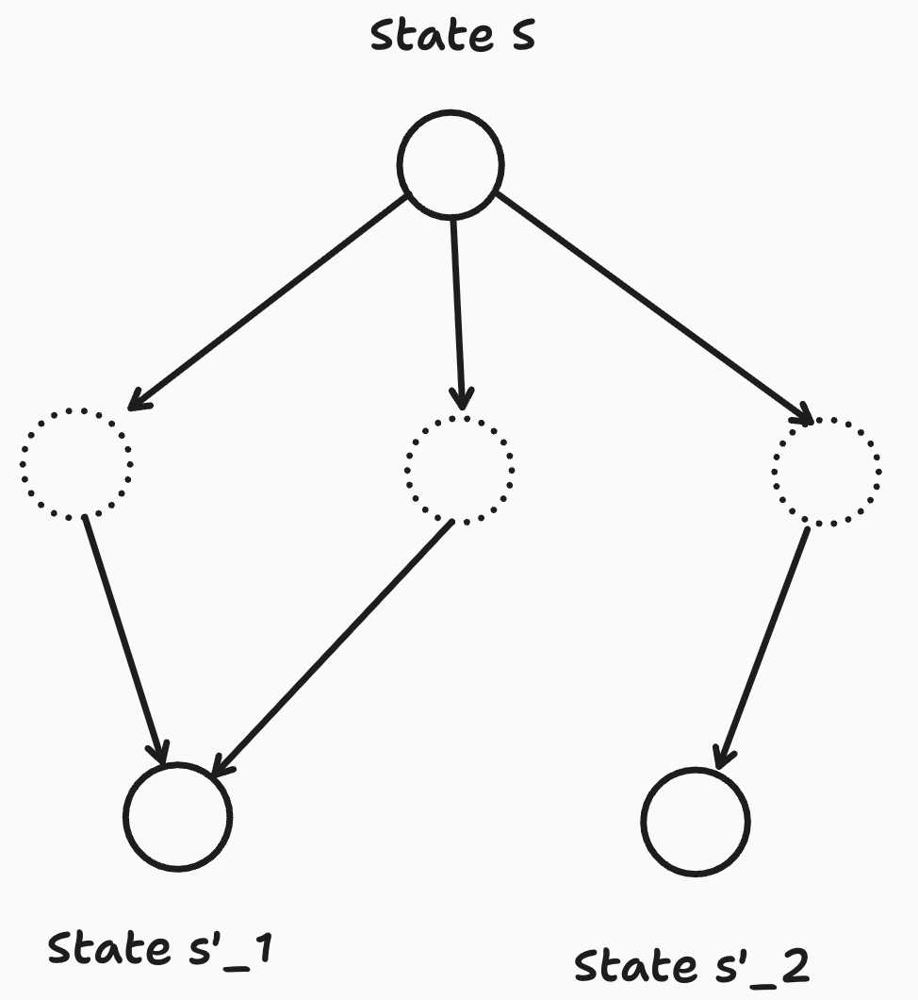

# Backgammon Engine API
This crate implements the environment - the rules, moves and state transitions - for the game of Backgammon in form an engine API.
In a more formal manner, the game environment can be described as a finite Markov Decision Process (MDP).
The MDP is characterizes as a random sequence of states $s \in S$ which are all possible legal game states and
actions (game moves) taken by one player to get from state $s$  to $s'$.
The game state is represented by the following datastructure:
```
pub struct BackgammonState {
    pub board: [i32; 24],
    pub white_caught: i32,
    pub black_caught: i32,
    pub black_bearing: bool,
    pub white_bearing: bool,
    pub ended: bool,
    pub black_outside: i32,
    pub white_outside: i32,
}
```
Black checkers are represented by positive integers, white checkers by negative integers on the board array. Before every move by either side two game dice are thrown, hence - unlike chess - Backgammon has a highly stochastic game environment.
Moves that can be be performed for a given state $s$ are highly dependent on the random vector of dice $\vec{x}$.
Oftentimes the state transitons in the MDP are defined by the the function : $f: (s) -> A$ in which from a state $s$ the set off all possible actions
are given back that can be performed by the agent. However the state transition function implemented in this crate refers to what Sutton refers to an *afterstate* function [1]. 

$$ 
    f: (s, \vec{x}) -> S'
$$

Backgammon is played with two dice, so a state transition consists of two submoves (when doubles are thrown even four submoves). Oftentimes different move can lead to the same resulting state. Hence instead of given back the set aóf all possible actions that can be performed at this state of the game,  

<p align="center">
  
</p>

Oftentimes the goal in Reinforcement learning is that the agent learns a policy (strategy) to pick the next state form all possible next states that optimize the probability of winning in some capacity. This libary helps providing the environment for determining the best strategy for algorithmic backgammon in a computationally efficient way.

# Example usage of the API
This simulates an example game in which black starts adn the same dice are used for every move and the strategy of taking the first entry of the next state array for both sides. 
```
use backgammon_engine::backgammonstate::{ STARTING_GAME_STATE, BackgammonState, gen_poss_next_states};
use rand_distr::{Distribution, Uniform};
use rand::{Rng, thread_rng};


fn generate_dice(rng: &mut impl Rng) -> Vec<i32> {
    let die_dist = Uniform::new_inclusive(1, 6).unwrap();
    let d1 = die_dist.sample(rng);
    let d2 = die_dist.sample(rng);

    if d1 == d2 {
        vec![d1, d1, d1, d1]
    } else {
        vec![d1, d2]
    }
}

fn pick_next_move(next_poss_states : &Vec<BackgammonState>, rng: &mut impl Rng) -> BackgammonState {
    let die_dist = Uniform::new_inclusive(0, next_poss_states.len() - 1).unwrap();
    let index = die_dist.sample(rng);
    return next_poss_states[index];
}

fn simulate_game() {
    let mut rng = thread_rng();

    for x in 0..number_of_games {
        let mut counter = 0;
        let mut current_game_state = STARTING_GAME_STATE;
        let mut is_black = true;
        while !current_game_state.ended {
            let dice = generate_dice(&mut rng);
            let next_poss_states = gen_poss_next_states(current_game_state, is_black, dice.clone())
                            .expect("Failed to generate possible next states");
            current_game_state = pick_next_move(&next_poss_states, &mut rng);
            is_black = !is_black;
        }
    }
}

fn main() {
    test_public_api();
}
```

This crate implements
- Markov decision process and mathematical tuple
- Afterstate function and formula
- State object and boolean caching
- no dependencies
- tested

# Testing Methodology
- invariants
- it is hard to prove that a program is correct ==> negative space programming
- monte carlo simulation of integration testing
- 1000000 games simulated without panicking

# References

[1]: Sutton, R. S., & Barto, A. G. (2015). *Reinforcement Learning: An Introduction*. MIT Press.


# Contributing
If you want to contribute to this repository, please open an issue or submit a pull request following the project’s contribution guidelines.
